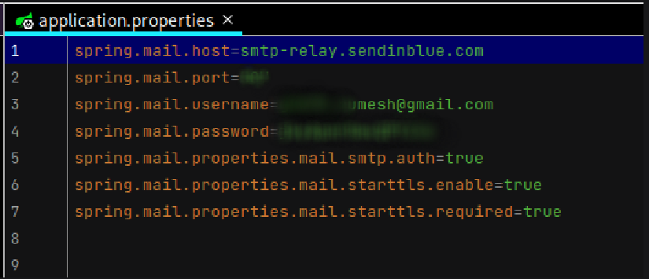
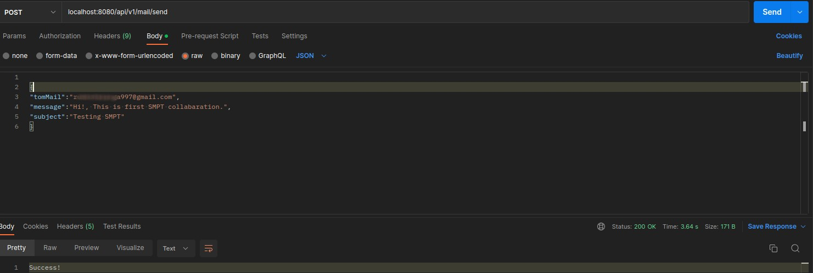

# Email-Proccessing-System-with-SMPT-SpringBoot

### Finalized application.properties. There are configured with SENDINBLUE SMPT server 

### Create a sample email from postman

### Successfully recived mail to the selected email address

